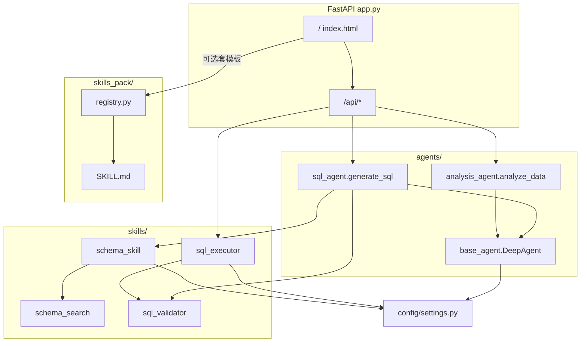
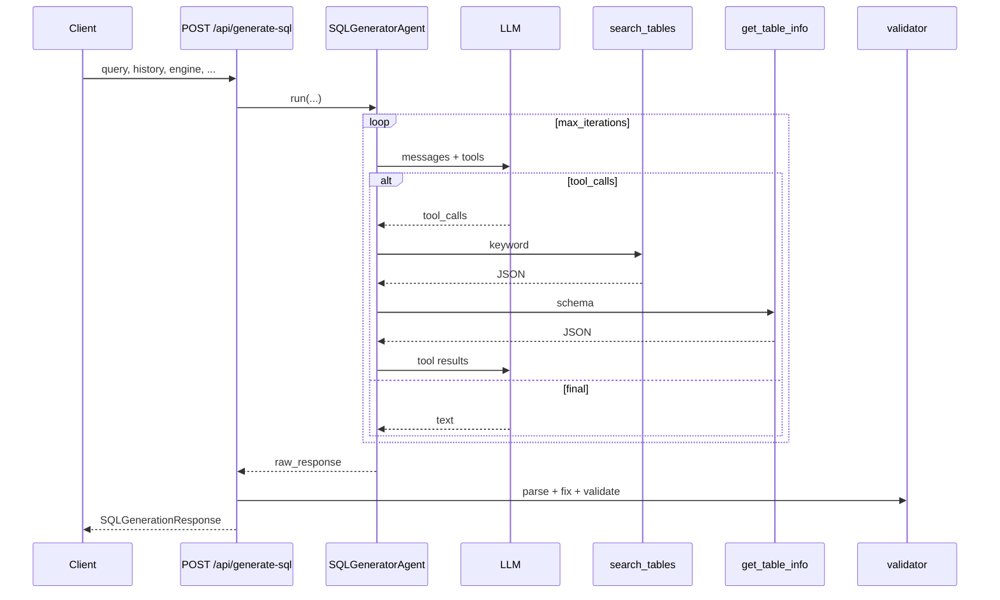
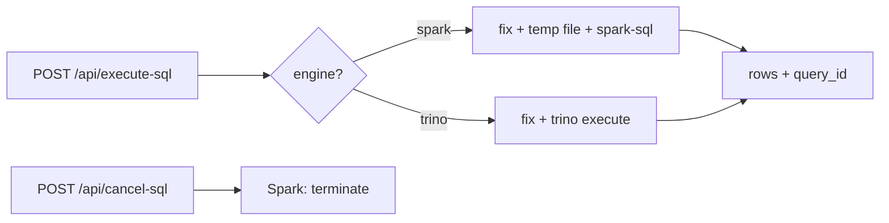
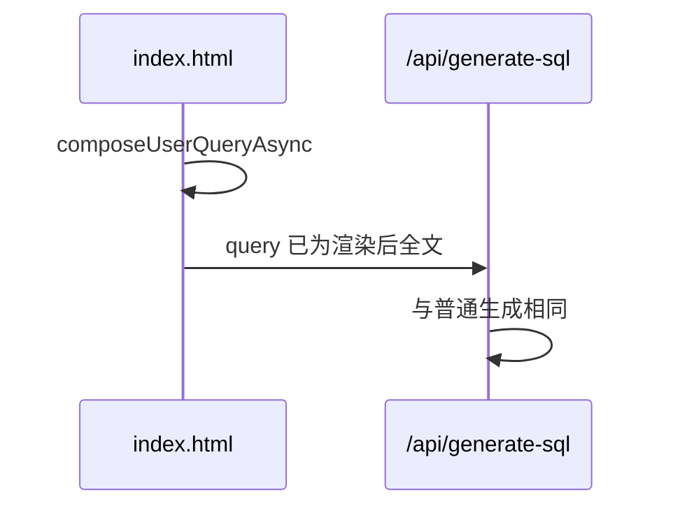

# Schemist · `ai_service_2` 技术架构（开源版）

本文档描述本仓库中 **`ai_service_2/`** 的设计原理、核心流程与对外能力：FastAPI 服务、自研多轮 **DeepAgent**（function calling）、本地 Schema 工具链、**Skills Pack** 提示词模板、Spark/Trino 双引擎只读执行等。

> **开源说明**：本文档由内部实现说明整理而来，已去除绝对磁盘路径、特定业务线命名与可识别生产细节；示例表名、接口说明以**虚构或通用占位**为主，部署时请替换为你自己的元数据与环境变量。  
> **术语**：文中 **Skill** 指 Agent 内部的 **function calling 工具**（如 `search_tables`）；**Skills Pack** 指用户侧的 **Markdown 提示词模板**（`skills_pack/<id>/SKILL.md`）。二者互不替代，对照说明见 **§2.8**。

---

## 1. 设计目标与总体架构

### 1.1 设计取向

- **Agent + 工具分层**：大模型负责推理与编排；表检索、校验、执行等与数据环境强相关的逻辑下沉为可测试、可替换的 **Skill**。
- **双引擎统一入口**：同一套「自然语言 → SQL →（可选）执行 →（可选）结果分析」链路，按请求选择 **Spark SQL** 或 **Trino**，在 Prompt 与语法修复层区分方言。
- **本地 Schema 知识库**：从本地目录加载 Hive/表结构 JSON（仓库内 `hivebrain/` 为目录约定；**具体库的 JSON/Markdown 导出由根目录 `.gitignore` 排除**，本地生成后指向 `SCHEMA_BASE_DIRS`），供 Agent 工具调用；不强制在运行时拉取线上元数据中心。
- **Web 与 API 一体**：单进程提供页面（Jinja2）与 REST API；可选 **Webhook 类机器人**（如飞书/Lark）走同一套生成与执行代码路径（见 `feishu_bot_api.py`，可完全不启用）。

### 1.2 技术栈

| 层次 | 技术 |
|------|------|
| Web | FastAPI、Uvicorn、Jinja2、静态资源 `/static` |
| LLM | OpenAI 兼容 SDK；模型列表可配置，支持请求级 `llm_model` 白名单 |
| Agent | 自研 `DeepAgent`（`agents/base_agent.py`）：多轮 chat + tool_calls |
| Skills Pack | `skills_pack/` + `registry.py`（YAML frontmatter + Markdown，mtime 热加载，可选 CRUD） |
| Schema 检索 | `skills/schema_search.py`：BM25 + 倒排 + 启发式混合；`config/schema_aliases.json` 同义词 |
| 数据执行 | Spark：`spark-sql` 子进程；Trino：`trino` Python 包（需单独安装） |
| 前端 | Bootstrap、CodeMirror、Chart.js 等 |

### 1.3 模块拓扑

---

## 2. 核心设计原理

### 2.1 DeepAgent（轻量多步 Agent）

- **Skill 抽象**：`Skill(name, description, func, parameters)` → 映射为 OpenAI tools 的 `function` schema。
- **主循环**（`max_iterations` 可配置，SQL 场景典型为有限次）：
  1. 将 system + 可选 `history` + user 发给模型；
  2. 若返回 `tool_calls`，调用对应 `Skill.run(**args)`，结果以 `role: tool` 写回；
  3. 直到模型产出最终文本（无 tool_calls）或达到迭代上限。
- **SQL 生成**：注册 `search_tables`、`get_table_info`；`run` 前可对 `history` 做**条数与单条字符数截断**（`SQL_AGENT_HISTORY_*`）。
- **分析**：`simple_chat` 无工具，生成 Markdown 报告。

#### 与 LangChain 生态「Deep Agents」库的区别（命名澄清）

自研 `DeepAgent` 与社区项目 [langchain-ai/deepagents](https://github.com/langchain-ai/deepagents) **仅名称相近**。本项目内核为 **OpenAI 兼容 chat + tool_calls 的瘦循环**，便于审计与垂直裁剪；社区 Deep Agents 面向更通用的多步自治任务（待办、工作区、子 Agent 等）。若未来需要通用 harness，可再评估引入或局部借鉴。

### 2.2 Schema Skill + 检索子系统

**索引**：扫描 `SCHEMA_BASE_DIRS` 下各库的 `json/*.json`；若 `SCHEMA_ALLOWED_DBS` 非空则只索引指定库。表记录含 `full_name`、注释、列名/列注释拼成的检索文本；可选 `table_priority`、`domain`/`subject` 参与加权。

**检索**：可启用 BM25+倒排（`SCHEMA_SEARCH_USE_BM25`）；与同义词扩展（`expand_query_terms` + `schema_aliases.json`）及启发式子串分混合（`SCHEMA_SEARCH_BM25_WEIGHT`）。

**表目录 `build_table_catalog`**：按 `SCHEMA_CATALOG_MODE`（`minimal` / `standard` / `full`）生成注入 System Prompt 的目录文本并缓存；列级细节仍以 `get_table_info` 为准。

**`get_table_info(table_name, full_detail=...)`**：默认可先返回**摘要列**（分区列、标记为 core/primary/key 的列、命中常见指标关键词的列等），需要时再 `full_detail=true` 拉全列。

**生成后**：对 SQL 中出现的 `db.table` 做未知表检查与列名纠偏（含防止单字母表别名被误匹配为列名等保护逻辑）。

### 2.3 SQL Validator

- 规则校验：聚合与非聚合混用、`GROUP BY` 风险等。
- 自动修复：CTE 缺列、Spark/Trino 方言差异（如 Trino 下 `ARRAY_LENGTH` → `CARDINALITY`、`LATERAL VIEW EXPLODE` → `CROSS JOIN UNNEST` 等）。

### 2.4 SQL Executor（双引擎）

- **入口**：`execute_sql(sql, engine, ...)` → `spark` 或 `trino`。
- **安全前缀**：仅允许以 `SELECT` / `WITH` / `EXPLAIN` / `SHOW` / `DESCRIBE` / `DESC` 等开头的只读语句（具体以前端与后端校验为准）。
- **Spark**：临时 `.sql` 文件 + `spark-sql` 子进程；解析 stdout 为表格式数据；支持取消登记（子进程终止）。
- **Trino**：DBAPI 执行 + `fetchmany` 控制行数。
- **超时**：由 `SQL_EXECUTOR_TIMEOUT` 等统一配置，避免各层硬编码不一致。
- **Spark 会话 SET**：可在执行器内注入常用 AQE/ shuffle 等默认 SET；`SPARK_SQL_SET_OVERRIDES` 可做 per-query 覆盖；对 `spark.driver.*` / `spark.executor.*` 等**启动期静态项**应避免用会话 SET 修改（由 `SPARK_EXTRA_CONFS` 等在提交参数中配置），否则易触发 *Cannot modify the value of a Spark config*。

### 2.5 查询历史与统计

内存队列 + 线程安全，定期落盘到 `logs/query_history.json`（具体频率见代码）；`/api/query-stats`、`/api/query-history` 提供聚合与筛选。

### 2.6 报告分享

`POST /api/share-report` 写入 `shared_reports/{id}.json`（及可选图表文件）；`GET /shared/{share_id}` 渲染 HTML，带过期策略（默认天数可配置）。

### 2.7 表匹配主路径（示意）

服务端**不依赖**单条正则从自然语言硬抽表名作为主路径；由 **LLM + 工具** 完成：表目录（Prompt）→ `search_tables` → `get_table_info` → 生成 SQL → 校验/纠偏。

### 2.8 Skills Pack（用户侧模板）

| 名称 | 层次 | 目的 |
|------|------|------|
| **Skill** | Agent 内部 | function calling 工具 |
| **Skills Pack** | 用户/前端 | 固化常见问法与口径的 Markdown 模板 |

**不变性**：未选技能时请求体 `query` 不变；选技能时由前端（或 `/api/skills/{id}/render` 预览）将 `{{user_query}}`、`{{engine}}`、`{{today}}` 等占位符替换后再调用 `/api/generate-sql`，**后端核心链路不感知「技能 ID」**。

**管理 API**：`GET/POST/PUT/DELETE /api/skills*`，写操作可通过 `SKILLS_ADMIN_TOKEN` + 请求头 `X-Skills-Admin-Token` 保护；未设置 token 时写路由可能默认放行（便于本地开发，**生产务必设置**）。

**内置示例**：`skills_pack/` 下含 `data-insights`、`schema-exploration`、`sql-rewrite` 及若干可编辑示例；业务方可复制目录结构自建模板，避免把真实表名与口径提交到公开仓库。

### 2.9 LLM 模型切换

- `LLM_MODEL_CHOICES` / `LLM_MODEL_CHOICES_JSON` + `GET /api/llm-models`。
- 请求体可选 `llm_model`，经 `resolve_llm_model` 白名单校验后传入 `DeepAgent.run(..., model=...)`。

### 2.10 稳定性要点（摘要）

- **JSON 与代码块并存时**：防止模型在 JSON 的 `sql` 字段写「见上文 SQL」类占位而遗漏可执行语句（解析侧闸门 + Prompt 约束）。
- **Trino 方言**：数组、侧视图等写法与 Spark 差异在执行前修复链中处理。
- **Schema 列纠偏**：对过短 token 与过长列名的误匹配加阈值，避免表别名被改错列名。

### 2.11 检索增强与反馈学习（可选）

- 在 BM25/启发式基础上可增加**意图分类 + 轻量 rerank**（规则为主，不依赖外呼排序模型）。
- 执行成功后可对命中表做**轻量持久化反馈**（动态叠加排序权重），路径默认 `ai_service_2/data/schema_table_feedback.json`，可用环境变量 `SCHEMA_FEEDBACK_PATH` 覆盖；**该文件可能反映你的查询习惯，开源发布前建议加入 `.gitignore`（本仓库已忽略）**。
- 只读接口：`GET /api/schema-feedback-stats`（若启用）。

### 2.12 重查询与 Spark 实践（与 Skills 模板协同）

多日窗口、多表 JOIN 类分析常见痛点：**客户端超时**、**广播过大导致 driver 压力**、**错误的 hint 位置或方言不支持 hint**、**分区裁剪失效**（如过度依赖生成列上的日期范围 CTE）。

**工程对策（与代码/配置一致）**：

- 统一调大 `SQL_EXECUTOR_TIMEOUT` 并与前端/API 默认值一致。
- Spark 默认注入合理 AQE / shuffle 相关 SET；大广播场景避免手写强制 `BROADCAST` hint，交由优化器；driver 内存与 `autoBroadcastJoinThreshold` 需匹配。
- SQL 多语句时若执行器只保留首条可执行语句，**不要在模板里依赖「首条之后的 SET」**；静态资源类 conf 走启动参数。
- **Skills Pack** 中面向长窗口的模板（如 `ab-experiment-multi-day`）应遵循：字面量分区范围、减少重复扫表、JOIN 键类型与引擎一致、避免不支持的 hint 语法。具体 SQL 骨架以仓库内 `SKILL.md` 为准。

### 2.13 可选 Webhook 机器人入口

`feishu_bot_api.py` 提供飞书/Lark 事件回调与全流程编排（生成 / 执行 / 分析 / 分享），与 Web 共用 `sql_executor`、超时与反馈学习逻辑。配置与订阅方式见 **`ai_service_2/docs/FEISHU_BOT.md`**。若不开通飞书应用，可忽略该路由。

**技能自动匹配**（若启用）：可按技能元数据打分选择模板；若误匹配，可通过更中性的自然语言、或直接带 `库.表` 全名等方式降低误触发，细节见代码注释。

---

## 3. 流程图

### 3.1 SQL 生成（含工具循环）

### 3.2 执行与取消

### 3.3 Skills Pack 套模板（前端路径）

---

## 4. API 与功能清单（摘要）

| 方法 | 路径 | 功能 |
|------|------|------|
| GET | `/` | 主界面 |
| POST | `/api/generate-sql` | 自然语言生成 SQL |
| POST | `/api/execute-sql` | 执行 SQL |
| POST | `/api/cancel-sql` | 取消执行 |
| POST | `/api/analyze-data` | 结果集分析 |
| POST | `/api/download-csv` | 导出 CSV |
| POST | `/api/share-report` | 创建分享 |
| GET | `/shared/{share_id}` | 查看分享 |
| GET | `/api/health` | 健康检查 |
| GET | `/api/query-stats` | 统计 |
| GET | `/api/query-history` | 历史 |
| GET | `/api/schema-feedback-stats` | 反馈学习统计（若启用） |
| GET | `/api/llm-models` | 模型列表 |
| GET/POST/PUT/DELETE | `/api/skills` 等 | Skills Pack |
| GET | `/docs`, `/redoc` | OpenAPI |

飞书相关：`POST /feishu/event` 等，见 OpenAPI 标签 `feishu` 与 `docs/FEISHU_BOT.md`。

---

## 5. 配置与部署要点

### 5.1 启动方式

- 在 **`ai_service_2/`** 目录执行 `./start_service.sh`（或 `./run.sh` / `./stop_service.sh`）。
- 脚本会创建 `logs/`、写入滚动日志与可选 PID 文件；若使用 Conda，可按本机 `conda.sh` 路径 `source` 后启动（**请勿在文档或仓库中写死他人机器上的绝对路径**）。
- 临时 SQL/CSV 默认在工作区目录下（可通过环境变量指定 workspace，见 `start_service.sh` 注释）。

### 5.2 监听与对外 URL

- `SERVICE_HOST`、`SERVICE_PORT` 控制绑定地址。
- 若需拼接完整分享链接给外部系统，可配置可对外访问的根 URL（见 `settings.py` 中相关项）。

### 5.3 LLM 与引擎

- LLM：`LLM_API_URL`、`LLM_API_KEY`、`LLM_MODEL`、超时与 token 上限等。
- Spark：`SPARK_SQL_CMD`、队列、executor/driver 资源、`SPARK_EXTRA_CONFS`、`SPARK_SQL_SET_OVERRIDES`、`SQL_EXECUTOR_TIMEOUT` 等。
- Trino：连接参数与 catalog/schema；确保运行环境已安装 `trino` 包。

### 5.4 Schema / Agent 相关配置（摘录）

| 配置项 | 含义 |
|--------|------|
| `SCHEMA_BASE_DIRS` | 本地表 JSON 根目录列表 |
| `SCHEMA_ALLOWED_DBS` | 非空时仅索引这些库名 |
| `SCHEMA_CATALOG_MODE` | 表目录详略 |
| `SCHEMA_ALIAS_MAP_PATH` | 同义词文件路径 |
| `SCHEMA_SEARCH_USE_BM25` | 是否启用 BM25 |
| `SCHEMA_SEARCH_BM25_WEIGHT` | BM25 与启发式混合权重 |
| `SQL_AGENT_HISTORY_MAX_TURNS` | 历史条数上限 |
| `SQL_AGENT_HISTORY_MAX_CHARS` | 单条历史最大字符 |

表 JSON 可选字段：`table_priority`、`domain`/`subject`；列级 `tier`/`tag` 为 `core`/`primary`/`key` 时优先进入摘要列。

### 5.5 离线生成 Schema 目录（`hivebrain/`）

仓库根目录脚本 **`get_spark_table_shecme_filter.py`** 用于在 **PySpark 客户端**（`spark-submit`，已 `enableHiveSupport()`）上从 Hive/Spark 元数据拉取表 DDL 与 `DESCRIBE EXTENDED` 信息，经筛选与结构化后输出 **JSON**（及可选 **Markdown**）、中文注释统计等。将 **`--output`** 设为 **`hivebrain/<库名>/`**（或与 `SCHEMA_BASE_DIRS` 中某一库路径一致），可在其下生成 **`json/<库>.<表>.json`**，与 `schema_skill` 索引约定的 `<database>/json/*.json` 对齐。运行时依赖集群侧 Metastore 访问权限；产出若含真实库表命名，开源发布前请脱敏或勿提交。

---

## 6. 关键文件索引

| 文件 | 职责 |
|------|------|
| `ai_service_2/app.py` | FastAPI 路由、历史、分享等 |
| `ai_service_2/config/settings.py` | 全局配置 |
| `ai_service_2/agents/base_agent.py` | DeepAgent、Skill |
| `ai_service_2/agents/sql_agent.py` | SQL 生成与后处理 |
| `ai_service_2/agents/analysis_agent.py` | 分析报告 |
| `ai_service_2/skills/schema_skill.py` | 索引、目录、工具、反馈 |
| `ai_service_2/skills/schema_search.py` | BM25 与检索 |
| `ai_service_2/skills/sql_validator.py` | 校验与修复 |
| `ai_service_2/skills/sql_executor.py` | 双引擎执行 |
| `ai_service_2/skills_pack/registry.py` | Skills Pack 注册与渲染 |
| `ai_service_2/feishu_bot_api.py` | 可选飞书全流程 |
| `ai_service_2/templates/index.html` | Web 前端 |
| `ai_service_2/docs/FEISHU_BOT.md` | 飞书对接说明 |
| `get_spark_table_shecme_filter.py` | 根目录：PySpark 离线拉取 Hive 表结构 → 清洗输出至 `hivebrain/<库>/json/` 等 |

---

## 7. 小结

**Schemist `ai_service_2`** 将「大模型推理」与「数仓落地能力」分层：**DeepAgent** 负责带工具的对话式 SQL 生成；**schema / validator / executor** 负责元数据、语法与只读执行；**Skills Pack** 在不改核心链路的前提下提升重复问题的可控性；可选 **Webhook 机器人** 与 Web 共用同一后端。

扩展时优先：**新增工具或 SKILL.md**、调整 `settings.py` / 环境变量、替换 Schema JSON 目录，通常无需改动 HTTP API 契约。
